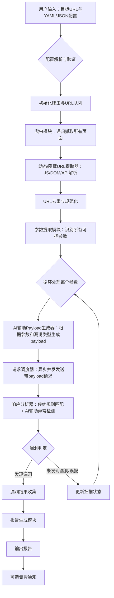

# AutoVulnScan 架构设计

本文档详细描述了 AutoVulnScan 系统的核心架构、模块划分和设计原则。

## 1. 设计哲学

AutoVulnScan 遵循以下设计哲学：

- **模块化**: 系统被划分为一系列高内聚、低耦合的模块，每个模块负责单一的功能。这使得系统易于维护、扩展和测试。
- **异步优先**: 核心扫描流程采用异步 I/O 模型，以实现高并发和高性能。
- **AI 赋能**: 在关键决策点（如 Payload 生成、响应分析）集成 AI 大模型，以提高扫描的智能化水平和准确性。
- **可扩展性**: 插件化的漏洞扫描框架允许开发者轻松添加新的漏洞检测能力。
- **配置驱动**: 扫描行为完全由外部配置文件驱动，为用户提供高度的灵活性。

## 2. 系统流程

系统工作流程如下图所示：

## 3. 模块详解

（此处将详细介绍每个模块的职责和技术实现）
